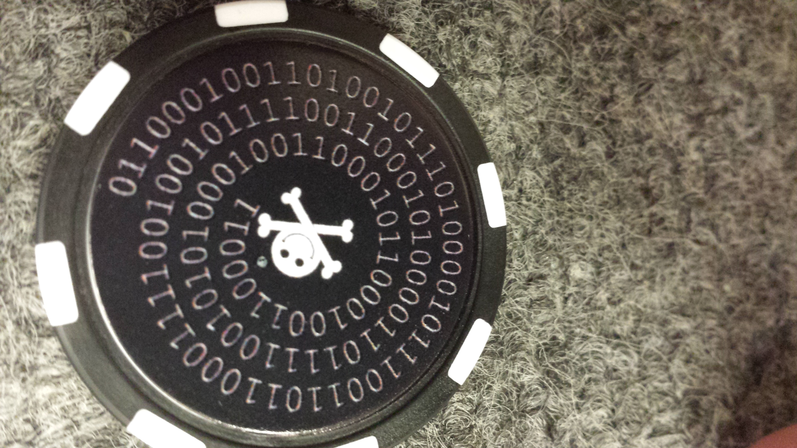

# crypto

## Coin
1. Receive this coin at DEFCON

2. 

Binary to ascii

## Website

Single image is not displayed

## Image
http://thehackerplaybook.com/defcon_coin/coin.gif

is actually a base64 encoded file

## Decode
`node decode.js`

base64 is actually a hexadecimal representation of the file

`file out.hex` to determine file type

## Next steps?
